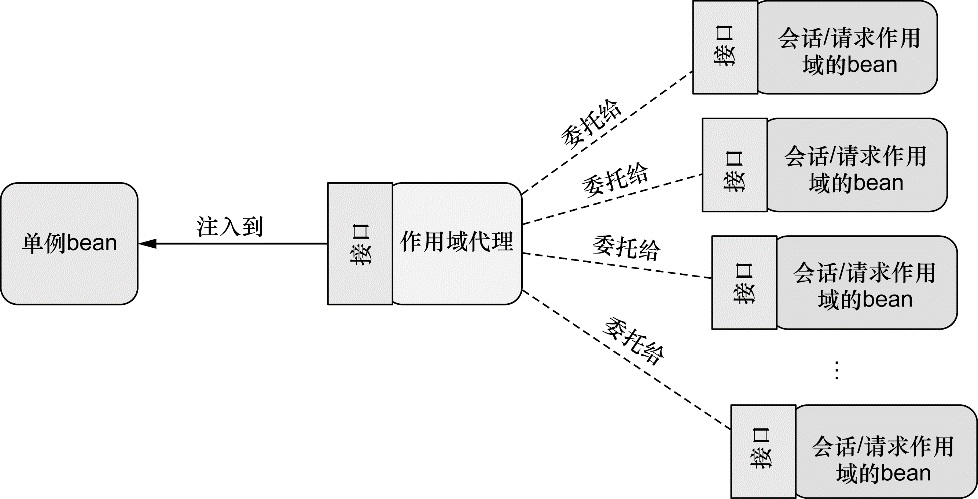

# bean 的作用域

Spring 定义了多种作用域，可以基于这些作用域创建 bean，包括：

* <mark style="color:blue;">**单例（Singleton）**</mark>：在整个应用中，只创建 bean 的一个实例。
* <mark style="color:blue;">**原型（Prototype）**</mark>：每次注入或者通过 Spring 应用上下文获取的时候，都会创建一个新的 bean 实例。
* <mark style="color:blue;">**会话（Session）**</mark>：在 Web 应用中，为每个会话创建一个 bean 实例。
* <mark style="color:blue;">**请求（Rquest）**</mark>：在 Web 应用中，为每个请求创建一个 bean 实例。

**单例是默认的作用域，如果选择其他的作用域，要使用 @Scope 注解，它可以与 @Component 或 @Bean 一起使用**。例如，如果你使用组件扫描来发现和声明 bean，那么你可以在 bean 的类上使用 @Scope 注解，将其声明为原型 bean：

```java
@Component
@Scop(ConfigurableBeanFactory.SCOPE_PROTOTYPE)
public class Notepad { ... }
```

要指定会话作用域，我们可以使用 @Scope 注解，它的使用方式与指定原型作用域是相同的：

```java
@Component
@Scope(value=WebApplicationContext.SCOPE_SESSION,
       proxyMode=ScopedProxyMode.INTERFACES)
public ShoppingCart cart() { ... }
```

这里，我们**将 value 设置成了 WebApplicationContext 中的 **<mark style="color:blue;">**SCOPE\_SESSION**</mark>** 常量**（它的值是 session）。这会告诉 Spring 为 Web 应用中的每个会话创建一个 ShoppingCart。这会创建多个 ShoppingCart bean 的实例，但是对于给定的会话只会创建一个实例，在当前会话相关的操作中，这个 bean 实际上相当于单例的。

**@Scope** 同时还有一个 **proxyMode 属性，它被设置成了 ScopedProxyMode.INTERFACES**。这个属性解决了将会话或请求作用域的 bean注入到单例 bean 中所遇到的问题。

> 假设我们要将 ShoppingCart bean 注入到单例 StoreService bean 的 Setter 方法中，如下所示：
>
> 
> ```java
> @Component
> public class StoreService {
>   @Autowired
>   public void setShoppingCart(ShoppingCart shoppingCart) {
>     this.shoppingCart = shoppingCart;
>   }
> }
> ```
> 
>
> 因为 **StoreService 是一个单例的 bean，会在 Spring 应用上下文加载的时候创建**。当它创建的时候，Spring 会试图将 ShoppingCart bean 注入到 setShoppingCart() 方法中。但是 ShoppingCart bean 是会话作用域的，此时并不存在。直到某个用户进入系统，创建了会话之后，才会出现 ShoppingCart 实例。
>
> 另外，系统中将会有多个 ShoppingCart 实例：每个用户一个。我们并不想让 Spring 注入某个固定的 ShoppingCart 实例到 StoreService 中。我们希望的是当 StoreService 处理购物车功能时，它所使用的 ShoppingCart 实例恰好是当前会话所对应的那一个。
>
> Spring 并不会将实际的 ShoppingCart bean 注入到 StoreService 中， Spring 会注入一个到 ShoppingCart bean 的代理，如图所示。
>
> 
>
> 这个代理会暴露与 ShoppingCart 相同的方法，所以 StoreService 会认为它就是一个购物车。但是，**当 StoreService 调用 ShoppingCart 的方法时，代理会对其进行懒解析并将调用委托给会话作用域内真正的 ShoppingCart bean**。

现在，我们带着对这个作用域的理解，讨论一下 proxyMode 属性。**如配置所示，proxyMode 属性被设置成了 ScopedProxyMode.INTERFACES，这表明这个代理要实现 ShoppingCart 接口，并将调用委托给实现 bean。**

<mark style="color:blue;">**如果 ShoppingCart 是接口而不是类的话，这是可以的（也是最为理想的代理模式）**</mark>。<mark style="color:orange;">**但如果 ShoppingCart 是一个具体的类的话**</mark>， Spring 就没有办法创建基于接口的代理了。此时，<mark style="color:orange;">**它必须使用 CGLib 来生成基于类的代理。所以，如果 bean 类型是具体类的话，我们必须要将 proxyMode 属性设置为 ScopedProxyMode.TARGET\_CLASS，以此来表明要以生成目标类扩展的方式创建代理**</mark>。

尽管我主要关注了会话作用域，但是**请求作用域**的 bean 会面临相同的装配问题。因此，请求作用域的 bean 应该也以作用域代理的方式进行注入。
