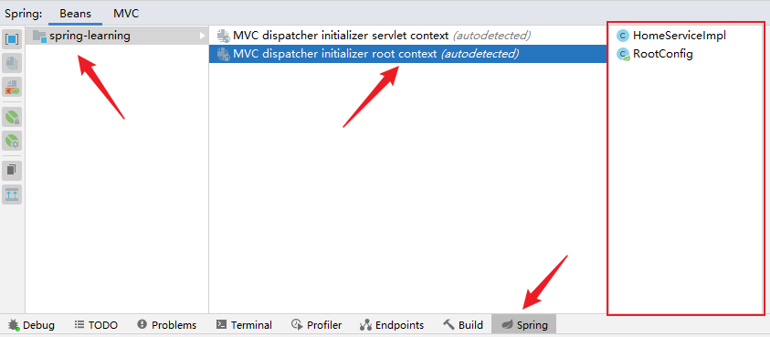

---
layout:
  title:
    visible: true
  description:
    visible: false
  tableOfContents:
    visible: true
  outline:
    visible: true
  pagination:
    visible: true
---

# 2 搭建Spring MVC

## **引入依赖**


```xml
	<!--
            ======================== Spring ========================
        -->
        <dependency>
            <groupId>org.springframework</groupId>
            <artifactId>spring-webmvc</artifactId>
        </dependency>

        <dependency>
            <groupId>com.fasterxml.jackson.core</groupId>
            <artifactId>jackson-databind</artifactId>
            <version>2.14.2</version>
        </dependency>

        <!--
            ======================== Swagger ========================
        -->
        <dependency>
            <groupId>com.github.xiaoymin</groupId>
            <artifactId>knife4j-spring-mvc</artifactId>
            <version>2.0.5</version>
        </dependency>
        <dependency>
            <groupId>com.fasterxml</groupId>
            <artifactId>classmate</artifactId>
            <version>1.5.1</version>
        </dependency>

        <!--
            ======================== Servlet ========================
        -->
        <dependency>
            <groupId>javax.servlet</groupId>
            <artifactId>javax.servlet-api</artifactId>
            <version>3.1.0</version>
            <scope>provided</scope>
        </dependency>
```


## **配置DispatcherServlet**

<mark style="color:red;">**扩展AbstractAnnotationConfigDispatcherServletInitializer的任意类都会自动地配置DispatcherServlet和Spring应用上下文，Spring的应用上下文会位于应用程序的Servlet上下文之中。**</mark>

> 在Servlet 3.0环境中，容器会在类路径中查找实现了**javax.servlet.ServletContainerInitializer**接口的类，如果能发现的话，就会用它来配置Servlet容器。
>
> Spring提供了这个接口的实现，名为**SpringServletContainerInitializer**，这个类反过来又会查找实现**WebApplicationInitializer**的类并将配置的任务交给它来完成。Spring 3.2引入了一个便利的WebApplicationInitializer的基础实现——AbstractAnnotationConfigDispatcherServletInitializer。


```java
package com.study.spring.config;

import org.springframework.web.servlet.support.AbstractAnnotationConfigDispatcherServletInitializer;

/**
 * @author Zhang B H
 * @create 2023-10-02 15:39
 */
public class StudyWebAppInitializer extends AbstractAnnotationConfigDispatcherServletInitializer {

    /**
     * 创建Spring应用上下文。
     * 加载包含Web组件的bean，如控制器、视图解析器以及处理映射器。
     *
     * @return 无论返回的数组是否为空，都会创建应用上下文
     */
    @Override
    protected Class<?>[] getServletConfigClasses() {
        return new Class[] {ServletConfig.class};
    }

    /**
     * 在Spring Web应用中，通常还会有另一个应用上下文，该上下文交由ContextLoaderListener创建。
     * 加载应用中的其他bean，这些bean通常是驱动应用后端的中间层和数据层组件的。
     *
     * @return 如果返回的数组为空，并不会创建应用上下文
     */
    @Override
    protected Class<?>[] getRootConfigClasses() {
        return new Class[]{RootConfig.class};
    }

    /**
     * 将一个或多个路径映射到 DispatcherServlet上。
     * @return
     */
    @Override
    protected String[] getServletMappings() {
        return new String[] { "/study" };
    }
}
```


当DispatcherServlet启动的时候，它会创建<mark style="color:blue;">**Spring应用上下文**</mark>，并加载配置文件或配置类中所申明的bean。此时，<mark style="color:blue;">**会使用由getServletConfigClasses()方法返回的ServletConfig配置类来加载Spring应用上下文**</mark>。

在Spring Web应用中，通常还会有<mark style="color:blue;">**另一个应用上下文**</mark>，该上下文交由<mark style="color:blue;">**ContextLoaderListener**</mark>创建。<mark style="color:blue;">**此上下文所使用的配置类由getRootConfigClasses()方法返回的RootConfig配置类进行配置。**</mark>

AbstractAnnotationConfigDispatcherServletInitializer 会同时创建 DispatcherServlet 和 ContextLoaderListener。getServletConfigClasses() 方法返回的类将会用来定义 DispatcherServlet 应用上下文中的 bean。getRootConfigClasses() 方法返回的类将会用来配置 ContextLoaderListener 创建的应用上下文中的 bean。

> For many applications, having a single `WebApplicationContext` is simple and suffices. It is also possible to have a context <mark style="color:blue;">hierarchy</mark> where <mark style="color:blue;">one root</mark> <mark style="color:blue;"></mark><mark style="color:blue;">`WebApplicationContext`</mark> <mark style="color:blue;"></mark><mark style="color:blue;">is shared across multiple</mark> <mark style="color:blue;"></mark><mark style="color:blue;">`DispatcherServlet`</mark> <mark style="color:blue;"></mark><mark style="color:blue;">(or other</mark> <mark style="color:blue;"></mark><mark style="color:blue;">`Servlet`</mark><mark style="color:blue;">) instances, each with its own child</mark> <mark style="color:blue;"></mark><mark style="color:blue;">`WebApplicationContext`</mark> <mark style="color:blue;"></mark><mark style="color:blue;">configuration</mark>.
>
> The root `WebApplicationContext` typically contains infrastructure beans, such as data repositories and business services that need to be shared across multiple `Servlet` instances. Those beans are effectively inherited and can be overridden (that is, re-declared) in the Servlet-specific child `WebApplicationContext`, which typically contains beans local to the given `Servlet`.

<mark style="color:blue;">**我们希望DispatcherServlet加载包含Web组件的bean，如控制器、视图解析器以及处理映射器，而ContextLoaderListener则加载应用中的其他bean，这些bean通常是驱动应用后端的中间层和数据层组件的。**</mark>

<figure><picture><source srcset="../../.gitbook/assets/mvc-context-hierarchy.png" media="(prefers-color-scheme: dark)"></picture><figcaption></figcaption></figure>

> 按照传统的方式，DispatcherServlet会配置在**web.xml**文件中，这个文件会放到应用的war包里面。
>
> 通过 AbstractAnnotationConfigDispatcherServletInitializer 来配置 DispatcherServlet 是传统 web.xml 方式的替代方案。如果你愿意的话，可以同时包含 web.xml 和 AbstractAnnotationConfigDispatcherServletInitializer，但这其实并没有必要。

> 如果按照这种方式配置 DispatcherServlet，而不是使用 web.xml 的话，那唯一问题在于它只能部署到支持 Servlet 3.0 的服务器中才能正常工作，如 <mark style="color:blue;">**Tomcat 7 或更高版本**</mark>。

## **启动Spring MVC**

```java
package com.study.spring.config;

import org.springframework.context.annotation.ComponentScan;
import org.springframework.context.annotation.Configuration;
import org.springframework.web.servlet.config.annotation.DefaultServletHandlerConfigurer;
import org.springframework.web.servlet.config.annotation.EnableWebMvc;
import org.springframework.web.servlet.config.annotation.WebMvcConfigurer;

/**
 * @author Zhang B H
 * @create 2023-10-02 15:40
 */
@EnableWebMvc
@Configuration
@Import(SwaggerConfig.class)
@ComponentScan("com.study.spring.controller")
public class ServletConfig implements WebMvcConfigurer {

    @Override
    public void configureDefaultServletHandling(
      DefaultServletHandlerConfigurer configurer) {
        configurer.enable(); // 要求DispatcherServlet将对静态资源的请求转发到默认的Servlet上
    }
}
```

在上述代码中：

* 通过<mark style="color:blue;">**@EnableWebMvc**</mark>注解来启用Spring MVC；
* 通过实现<mark style="color:blue;">**WebMvcConfigurer**</mark>接口，覆盖接口中的方法configureDefaultServletHandling来“配置对静态资源的处理”。**若不包含此配置，DispatcherServlet 会映射为应用的默认 Servlet，所以它会处理所有的请求，包括对静态资源的请求，如图片和样式表。**

```java
package com.study.spring.config;

import org.springframework.context.annotation.ComponentScan;
import org.springframework.context.annotation.FilterType;
import org.springframework.web.servlet.config.annotation.EnableWebMvc;

/**
 * @author Zhang B H
 * @create 2023-10-02 15:39
 */
@Configuration
@ComponentScan(
        basePackages = "com.study.spring",
        excludeFilters = {
                @ComponentScan.Filter(
                        type = FilterType.ANNOTATION, value = EnableWebMvc.class
                ),
                @ComponentScan.Filter(
                        type = FilterType.ANNOTATION, value = EnableSwagger2.class
                ),
                @ComponentScan.Filter(
                        type = FilterType.ANNOTATION, value = Controller.class
                )
        }
)
public class RootConfig {
}

```


实际上，RootConfig和ServletConfig都不需要@Configuration注解，之所以在不需要的情况下添加该注解，是为了利用IDEA能够查看Spring Bean的功能，如下图所示：


<figure><figcaption></figcaption></figure>

## **配置 Swagger （knife4j）**

```java
package com.study.spring.config;

import org.springframework.context.annotation.Bean;
import springfox.documentation.builders.PathSelectors;
import springfox.documentation.builders.RequestHandlerSelectors;
import springfox.documentation.spi.DocumentationType;
import springfox.documentation.spring.web.plugins.Docket;
import springfox.documentation.swagger2.annotations.EnableSwagger2;

/**
 * @author Zhang B H
 * @create 2023-10-03 19:01
 */
@EnableSwagger2
public class SwaggerConfig {

    @Bean
    public Docket api() {
        return new Docket(DocumentationType.SWAGGER_2)
                .select()
                    .apis(RequestHandlerSelectors.any())
                    .paths(PathSelectors.any())
                .build();
    }
}
```


<mark style="color:red;">**猜想：**</mark>

<mark style="color:orange;">在上述的spring mvc配置中，存在两个应用上下文，分别由DispatcherServlet和ContextLoaderListener所拥有。</mark>

<mark style="color:orange;">要想swagger能够正确运行，需要保证Swagger的配置位于DispatcherServlet所拥有的应用上下文之中，且不会出现在ContextLoaderListener所拥有的应用上下文中。</mark>


## **编写一个简单的控制器**

```java
package com.study.spring.controller;

import org.springframework.web.bind.annotation.GetMapping;
import org.springframework.web.bind.annotation.RestController;

/**
 * @author Zhang B H
 * @create 2023-10-02 16:23
 */
@RestController
public class HomeController {

    @GetMapping("home")
    public String home() {
        return "home";
    }
}

```

## **测试**

从 Spring 3.2 开始，可以按照控制器的方式来测试 Spring MVC 中的控制器了，而不仅仅是作为 POJO 进行测试。Spring 包含了一种 mock Spring MVC 并针对控制器执行 HTTP 请求的机制。这样的话，在测试控制器的时候，就没有必要再启动 Web 服务器和 Web 浏览器 了。

```java
package com.study.spring.controller;

import com.study.spring.config.ServletConfig;
import org.junit.Before;
import org.junit.Test;
import org.junit.runner.RunWith;
import org.springframework.beans.factory.annotation.Autowired;
import org.springframework.test.context.junit.jupiter.web.SpringJUnitWebConfig;
import org.springframework.test.context.junit4.SpringJUnit4ClassRunner;
import org.springframework.test.web.servlet.MockMvc;
import org.springframework.test.web.servlet.request.MockMvcRequestBuilders;
import org.springframework.test.web.servlet.result.MockMvcResultMatchers;
import org.springframework.test.web.servlet.setup.MockMvcBuilders;
import org.springframework.web.context.WebApplicationContext;

/**
 * @author Zhang B H
 * @create 2023-10-02 17:15
 */
private MockMvc mockMvc;

    @Before
    public void setUp() {
        mockMvc = MockMvcBuilders.standaloneSetup(new HomeController())
                .build();
    }

    @Test
    public void home() throws Exception {
        mockMvc.perform(
                MockMvcRequestBuilders.get("/home")
        ).andExpect(MockMvcResultMatchers.content().string("home"));
    }
}
```

## **访问swagger页面**

**knife4j的首页是doc.html**。

