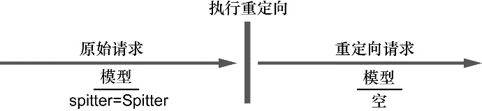
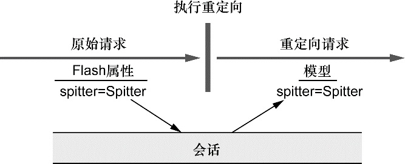

# 跨重定向请求传递数据

一般来讲，**当一个处理器方法完成之后，该方法所指定的模型数据将会复制到请求中，并作为请求中的属性，请求会转发（forward）到视图上进行渲染**。因为控制器方法和视图所处理的是同一个请求，所以在转发的过程中，请求属性能够得以保存。

<figure><figcaption></figcaption></figure>

但是，如上图所示，当控制器的结果是重定向的话，原始的请求就结束了，并且会发起一个新的 GET 请求。原始请求中所带有的模型数据也就随着请求一起消亡了。在新的请求属性中，没有任何的模型数据，这个请求必须要自己计算数据。

显然，对于重定向来说，模型并不能用来传递数据。但是我们也有一些其他方案，能够从发起重定向的方法传递数据给处理重定向方法中：

* **使用 URL 模板以路径变量和/或查询参数的形式传递数据；**
* **通过 flash 属性发送数据。**

## **1. URL模板**

当构建 URL 或 SQL 查询语句的时候，使用 String 连接是很危险的，因此Spring 提供了使用模板的方式来定义重定向 URL。

```java
@RequestMapping(value="/register", method=POST)
public String processRegistration(
    Spitter spitter, Model model) {
    spitterRepository.save(spitter);
  
    model.addAttribute("username", spitter.getUsername());
    model.addAttribute("spitterId", spitter.getId());
    return "redirect:/spitter/{username}";
}
```

现在，**username 作为占位符填充到了 URL 模板中**，而不是直接连接到重定向 String 中，所以 username 中所有的不安全字符都会进行转义。这样会更加安全，这里允许用户输入任何想要的内容作为 username，并会将其附加到路径上。

除此之外，**模型中所有其他的原始类型值都可以添加到 URL 中作为查询参数**。

按照上述代码，如果 username 属性的值是 habuma 并且 spitterId 属性的值是 42，那么结果得到的重定向 URL 路径将会是 /spitter/habuma?spitterId=42。

通过路径变量和查询参数的形式跨重定向传递数据是很简单直接的方式，但它也有一定的限制。<mark style="color:blue;">**它只能用来发送简单的值，如 String 和数字的值**</mark><mark style="color:blue;">。</mark>在 URL 中，并没有办法发送更为复杂的值，但这正是 flash 属性能够提供帮助的领域。

## **2. 使用flash属性**

假设我们不想在重定向中发送 username 或 ID 了，而是要发送实际的 Spitter 对象。如果我们只发送 ID 的话，那么处理重定向的方法还需要从数据库中查找才能得到 Spitter 对象。

正如我们前面所讨论的那样，模型数据最终是以请求参数的形式复制到请求中的，当重定向发生的时候，这些数据就会丢失。因此，我们需要将 Spitter 对象放到一个位置，使其能够在重定向的过程中存活下来。

有个方案是将 Spitter 放到<mark style="color:blue;">**会话**</mark>中。<mark style="color:blue;">**会话能够长期存在，并且能够跨多个请求**</mark>。所以我们可以在重定向发生之前将 Spitter 放到会话中，并在重定向后，从会话中将其取出。当然，我们还要负责在重定向后在会话中将其清理掉。

实际上，Spring 也认为将跨重定向存活的数据放到会话中是一个很不错的方式。但是，Spring 认为我们并不需要管理这些数据，相反，Spring 提供了将数据发送为 <mark style="color:blue;">**flash 属性（flash attribute）**</mark>的功能。 按照定义，<mark style="color:blue;">**flash 属性会一直携带这些数据直到下一次请求，然后才会消失。**</mark>

Spring 提供了通过 **RedirectAttributes** 设置 flash 属性的方法，这是 Spring 3.1 引入的 Model 的一个子接口。RedirectAttributes 提供了 Model 的所有功能，除此之外，还有几个方法是用来设置 flash 属性的。 具体来讲，<mark style="color:blue;">**RedirectAttributes 提供了一组 addFlashAttribute() 方法来添加 flash 属性**</mark>。

```java
@RequestMapping(value="/register", method=POST)
public String processRegistration(
    Spitter spitter, RedirectAttribute model) {
  spitterRespository.save(spitter);
  
  model.addAttribute("username", spitter.getUsername());
  model.addFlashAttribute("spitter", spitter);
  return "redirect:/spitter/{username}";
}
```

在这里，我们调用了 addFlashAttribute() 方法，并将 spitter 作为 key，Spitter 对象作为值。

<mark style="color:blue;">**在重定向执行之前，所有的 flash 属性都会复制到会话中。在重定向后，存在会话中的 flash 属性会被取出，并从会话转移到模型之中**</mark>。处理重定向的方法就能从模型中访问 Spitter 对象了，就像获取其他的模型对象一样。下图阐述了它是如何运行的：

<figure><figcaption></figcaption></figure>
