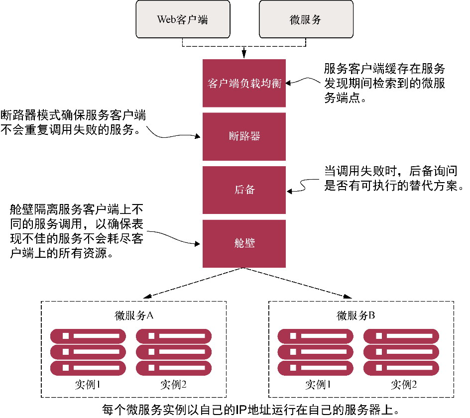

# 客户端弹性模式是什么

<mark style="color:blue;">**客户端弹性模式**</mark>的重点是，**在远程资源由于错误或表现不佳而失败时，保护调用远程资源的客户端免于崩溃**。这些模式允许客户端**快速失败**，而不消耗诸如数据库连接和线程池之类的宝贵资源。它们还可以防止远程服务表现不佳的问题向客户端的消费者进行**传播**。

<figure><figcaption></figcaption></figure>

这些模式（<mark style="color:blue;">**客户端负载均衡**</mark>、<mark style="color:blue;">**断路器**</mark>、<mark style="color:blue;">**后备**</mark>和<mark style="color:blue;">**舱壁**</mark>）是在调用远程资源的**客户端**（微服务）中实现的。这些模式的实现在逻辑上位于消费远程资源的客户端和资源本身之间。
