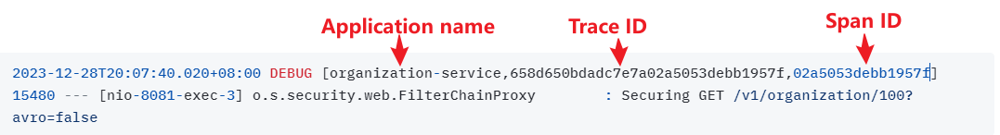

# Automated mapping of routes via service discovery

The SpringCloud Gateway can automatically route requests based on their service IDs by adding the following configurations to the gateway-server configuration file as shown in thefollowing listing.

```yaml
spring:
  cloud:
    gateway:
        # Enables the gateway to create routes based on services 
        # registered with service discovery
        discovery.locator:    
          enabled: true
          lowerCaseServiceId: true
```

By adding the lines in listing 8.5, the Spring Cloud Gateway automatically uses the Eureka service ID of the service being called and maps it to a downstream service instance. For instance, if we want to call our organization service and use automated routing via the Spring Cloud Gateway, we would have our client call the Gateway service instance using the following URL as the endpoint:

```properties
http://localhost:8072/organization-service/v1/organization/100
```

The Gateway server is accessed via the http://localhost:8072 endpoint. The service we want to invoke (the organization service) is represented by the first part of the endpoint path in the service.Figure 8.5 illustrates this mapping in action.

<figure><figcaption></figcaption></figure>

The beauty of using Spring Cloud Gateway with Eureka is that not only do we now have a single endpoint through which we can make calls, but we can also add and remove instances of a service without ever having to modify the gateway.

## Actuator 查询

If we want to see the routes managed by the Gateway server, we can list the routes via the actuator/gateway/routes endpoint on the Gateway server. This will return a listing of all the mappings on our service.

<details>

<summary><mark style="color:purple;">http://localhost:8072/actuator/gateway/routes</mark></summary>


```json
[
    {
        "predicate": "Paths: [/license-service/**], match trailing slash: true",
        "metadata": {
            "management.port": "8080"
        },
        "route_id": "ReactiveCompositeDiscoveryClient_LICENSE-SERVICE",
        "filters": [
            "[[RewritePath /license-service/?(?<remaining>.*) = '/${remaining}'], order = 1]"
        ],
        "uri": "lb://LICENSE-SERVICE",
        "order": 0
    },
    {
        "predicate": "Paths: [/gateway-server/**], match trailing slash: true",
        "metadata": {
            "management.port": "8072"
        },
        "route_id": "ReactiveCompositeDiscoveryClient_GATEWAY-SERVER",
        "filters": [
            "[[RewritePath /gateway-server/?(?<remaining>.*) = '/${remaining}'], order = 1]"
        ],
        "uri": "lb://GATEWAY-SERVER",
        "order": 0
    },
    {
        "predicate": "Paths: [/organization-service/**], match trailing slash: true",
        "metadata": {
            "management.port": "8081"
        },
        "route_id": "ReactiveCompositeDiscoveryClient_ORGANIZATION-SERVICE",
        "filters": [
            "[[RewritePath /organization-service/?(?<remaining>.*) = '/${remaining}'], order = 1]"
        ],
        "uri": "lb://ORGANIZATION-SERVICE",
        "order": 0
    }
]
```


</details>
