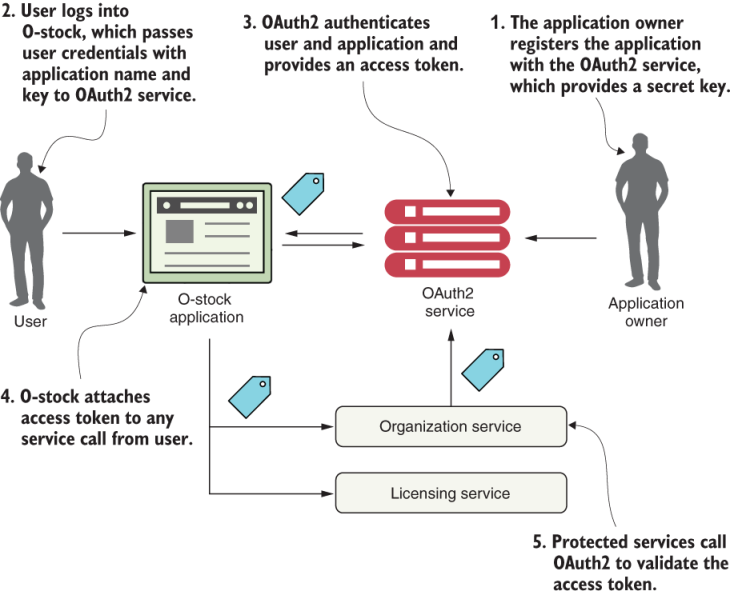

# Using messaging to communicate state changes between services

The messaging system is used by the organization service to publish any state changes within the data managed by the organization service when these occur. Figure 10.2 demonstrates this approach.

<figure><figcaption></figcaption></figure>

In the model in figure 10.2, when organization data changes, the organization service publishes a message to a topic. The licensing service monitors the topic for messages, and when a message arrives, it clears the appropriate organization record from the Redis cache. When it comes to communicating state, the message queue acts as an intermediary between the licensing and organization services. This approach offers four benefits: loose coupling, durability, scalability, and flexibility.

## LOOSE COUPLING

A messaging approach allows us to decouple the two services because, when it comes to communicating state changes, neither service knows about each other. When the organization service needs to publish a state change, it writes a message to a queue. The licensing service only knows that it gets a message; it has no idea who has published the message.

## DURABILITY

The presence of the queue allows us to guarantee that a message will be delivered even if the consumer of the service is down. For example, the organization service can keep publishing messages even if the licensing service is unavailable. The messages are stored in the queue and stay there until the licensing service becomes available. Conversely, with the combination of a cache and the queue approach, if the organization service is down, the licensing service can degrade gracefully because at least part of the organization data will be in its cache. Sometimes old data is better than no data.

## SCALABILITY

Because messages are stored in a queue, the sender of the message doesn’t have to wait for a response from the message consumer. The sender can go on its way and continue working. Likewise, if a consumer reading a message from the queue isn’t processing messages fast enough, it’s a trivial task to spin up more consumers and have them process the messages. This scalability approach fits well within a microservices model.

## FLEXIBILITY

The sender of a message has no idea who is going to consume it. This means we can easily add new message consumers (and new functionality) without impacting the original sending service. This is an extremely powerful concept because new functionality can be added to an application without having to touch existing services. Instead, the new code can listen for events being published and react to them accordingly.

## Downsides of a messaging architecture

A message-based architecture can be complicated and requires the development team to pay close attention to several key things, including message-handling semantics, message visibility, and message choreography.

### MESSAGE-HANDLING SEMANTICS

Using messages in a microservice-based application requires more than understanding how to publish and consume messages. It requires that we understand how our application will behave based on the order in which messages are consumed and what happens if a message is processed out of order. For example, if we have strict requirements that all orders from a single customer must be processed in the order they are received, we’ll need to set up and structure our message handling differently than if every message can be consumed independently of one another.

It also means that if we’re using messaging to enforce strict state transitions of our data, we need to think about designing our applications to take into consideration scenarios where a message throws an exception or an error is processed out of order. If a message fails, do we retry processing the error or do we let it fail? How do we handle future messages related to that customer if one of the customer’s messages fails? These are important questions to think through.

### MESSAGE VISIBILITY

Using messages in our microservices often means a mix of synchronous service calls and asynchronous service processing. The asynchronous nature of messages means they might not be received or processed in close proximity to when the message is published or consumed.

### MESSAGE CHOREOGRAPHY

a message-based application makes it more difficult to reason through its business logic because its code is no longer processed in a linear fashion with a simple block request-response model. Instead, debugging message-based applications can involve wading through the logs of several different services, where user transactions can be executed out of order and at different times.

