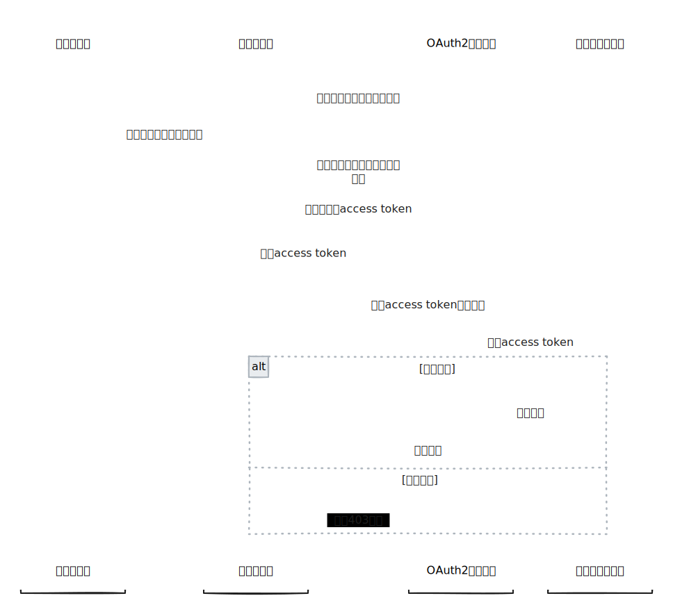

# 资源拥有者凭据许可

<figure><figcaption></figcaption></figure>

**使用资源拥有者凭据（Resource Owner Password Credentials）许可类型**获取access token 的流程如下：

1. 客户端应用所有者在OAuth2授权服务上注册客户端应用（第三方应用）。在注册时需要为客户端应用提供一个唯一名称，OAuth2授权服务则为该应用生成一个密钥。
2. 用户在客户端应用提供的认证页面上输入登录凭据。
3. 收到用户凭据后，客户端应用的后台将用户凭据、应用名称和密钥传递给OAuth2授权服务。
4. OAuth2授权服务对收到的信息进行验证，如果验证成功，则返回一个OAuth2访问令牌。
5. 客户端应用的后台在收到访问令牌后，会将其缓存起来，之后每次客户端应用代表用户调用服务时，都会传递该访问令牌。
6. 受保护资源的服务在收到携带访问令牌的请求后，会调用OAuth2授权服务以验证访问令牌。
   * 如果令牌有效，受保护资源允许用户访问。
   * 如果令牌无效，OAuth2服务返回HTTP状态码403，表示令牌无效。


## <mark style="color:orange;">注意</mark>

<mark style="color:orange;">**使用此授权类型时，应用程序和服务之间必须明确信任彼此。**</mark>

