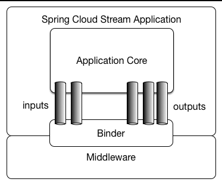

# 引入 Spring Cloud Stream

Spring Cloud Stream是用于构建基于消息驱动微服务应用程序的框架。它在Spring Boot的基础上构建独立的、生产级别的Spring应用程序，并利用Spring Integration提供与消息代理的连接。该框架提供了对多个中间件供应商的配置，引入了**持久的发布-订阅语义**、**消费者组**和**分区**的概念。

通过简单地将spring-cloud-stream的依赖项添加到应用程序的类路径中，即可立即连接到通过提供的spring-cloud-stream binder公开的消息代理，并可以使用简单的 **java.util.function.Function** 实现基于传入消息的功能需求。

## 应用模型

Spring Cloud Stream 应用程序由一个与中间件无关的核心组成，该应用通过在代码中建立**input/output**参数与**destination**（外部**代理**）之间的绑定，与外界进行通信。建立这些绑定所需的特定于代理的详细信息由中间件特定的**Binder**实现处理。

<figure><figcaption></figcaption></figure>

## 消费者群组

**Spring Cloud Stream 的消费者组类似于Kafka 的消费者群组**，订阅给定目标的所有组都会收到已发布数据的副本，但**每个组中只有一个成员会接收来自该目标的特定消息**。

每个消费者**绑定**都可以使用 **spring.cloud.stream.bindings.\<bindingName>.group** 属性指定一个组名。默认情况下，当未指定组时，Spring Cloud Stream 会将应用分配到一个匿名且独立的单成员消费者组。

> 通**常情况下，最好在将应用程序绑定到给定目标时始终指定一个消费者组。**
>
> 在扩展 Spring Cloud Stream 应用程序时，必须为其每个输入绑定指定一个消费者组。这样做可以防止应用程序实例接收到重复的消息（除非需要这种行为，这是不寻常的）。

## Consumer 类型 

Spring Cloud Stream 支持两种类型的消费者：

1. **消息驱动**（有时称为异步）：这种类型的消费者是通过消息的到达触发的，即一旦消息到达就会触发相应的处理。
2. **轮询**（有时称为同步）：这种类型的消费者是通过轮询获取消息，即定期检查是否有新消息。

> **当希望控制消息处理的速率时，可能会选择使用同步消费者。**

## 分区支持

**Spring Cloud Stream支持将数据在给定应用的多个实例之间进行分区**。

* 在分区的场景中，物理通信介质（例如代理主题）被看作是由多个分区构成的。
* **一个或多个生产者应用实例将数据发送到多个消费者应用实例，并确保由共同特征标识的数据由同一消费者实例处理。**

<mark style="color:blue;">**Spring Cloud Stream提供了一种统一的抽象，以一致的方式实现分区支持。因此，无论代理本身是否支持分区（例如Kafka），都可以使用分区（例如RabbitMQ）。**</mark>

> **要设置分区处理场景，必须同时配置数据生成和数据消费的两端。**
