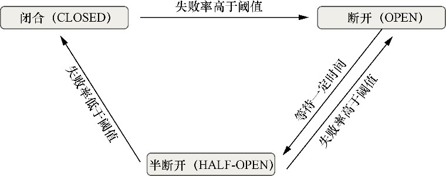

# 断路器模式

## **介绍**


<mark style="color:blue;">**断路器充当了应用程序和远程服务之间的中间人。**</mark>

有了<mark style="color:blue;">**断路器**</mark>，当远程服务被调用时，断路器将监控这个调用。<mark style="color:blue;">**如果调用时间太长，断路器将会介入并中断调用**</mark>。此外，断路器模式将监控所有对远程资源的调用，如果调用失败次数足够多，那么断路器实现就会“打开”并采取快速失败，阻止将来调用失败的远程资源。


在<mark style="color:blue;">**Resilience4j**</mark>中，断路器是通过存在3个状态的有限状态机实现的：

<figure><figcaption></figcaption></figure>

最初，Resilience4j断路器以<mark style="color:blue;">**闭合状态**</mark>启动并等待客户端请求。闭合状态使用一个<mark style="color:blue;">**环形比特缓冲区**</mark>来存储请求的成功或失败状态。当请求成功时，断路器在环形比特缓冲区中保存一个 0 比特；如果它无法从被调用的服务接收响应，那么断路器在环形比特缓冲区中保存一个 1比特。

**要计算失败率，这个环必须是满的**。例如，如果环形比特缓冲区的大小为 12 比特，那么至少需要评估 12 次调用才能计算出失败率。如果只评估了 11 次调用，即使 11 次调用都失败，断路器也不会变为<mark style="color:blue;">**断开状态**</mark>。注意，<mark style="color:blue;">**只有当失败率高于配置的阈值时，断路器才会断开。**</mark>

当断路器处于<mark style="color:blue;">**断开状态**</mark>时，<mark style="color:blue;">**在配置的时间内，所有的调用都将被拒绝**</mark>，并且断路器抛出一个CallNotPermittedException 异常。

一旦配置时间到期，断路器就会变为<mark style="color:blue;">**半断开状态**</mark>，并允许一些请求通过以查看服务是否仍然不可用。在半断开状态下，断路器使用另一个<mark style="color:blue;">**环形比特缓冲区**</mark>来评估失败率。如果这个新的失败率**大于**配置的阈值，则断路器变回**断开**状态；如果**小于或等于**配置的阈值，则断路器变回**闭合**状态。


## <mark style="color:orange;">注意：</mark>

<mark style="color:orange;">**Resilience4j的断路器并不包含“超时中断”功能，其对于一次请求的失败判定是依靠异常来作出的（由 recordExceptions 属性指定）**</mark>


## 配置

```yaml
resilience4j.circuitbreaker:
  configs:
    shared:
      # Indicates whether to expose the configuration over the health endpoint
      registerHealthIndicator: true
      # Sets the ring buffer size at the closed state
      ringBufferSizeInClosedState: 5
      # Sets the ring buffer size in the half-open state
      ringBufferSizeInHalfOpenState: 3
      # Sets the wait duration for the open state
      waitDurationInOpenState: 10s
      # Sets the failure rate threshold percentage
      failureRateThreshold: 50
  instances:
    # Licensing service instance configuration.
    # (The name given to the circuit breaker in the annotation.)
    licenseService:
      baseConfig: shared
      # Sets the exceptions that should be recorded as failures
      recordExceptions:
        - org.springframework.web.client.HttpServerErrorException
        - java.io.IOException
        - java.util.concurrent.TimeoutException
        - org.springframework.web.client.ResourceAccessException
    # Organization service instance configuration.
    organizationService:
      baseConfig: shared
      ringBufferSizeInClosedState: 6
      ringBufferSizeInHalfOpenState: 4
      waitDurationInOpenState: 20s
      failureRateThreshold: 60
```

* **ringBufferSizeInClosedState（闭合状态环形缓冲区大小）：** 在断路器处于闭合状态时，设置环形位缓冲区的大小。**默认值为100**。
* **ringBufferSizeInHalfOpenState（半开状态环形缓冲区大小）：** 在断路器处于半开状态时，设置环形位缓冲区的大小。**默认值为10。**
* **waitDurationInOpenState（开启状态等待时间）：** 设置断路器从开启状态变为半开状态之前应等待的时间。**默认值为60,000毫秒**。
* **failureRateThreshold（失败率阈值）：** 配置失败率的百分比阈值。当失败率大于或等于此阈值时，断路器会切换到开启状态并开始短路调用。**默认值为50。**
* **recordExceptions（记录异常）：** 列出将被视为失败的异常。默认情况下，所有异常都记录为失败。

## 使用

### @CircuitBreaker 注解

Resilience4j和Spring Cloud使用 <mark style="color:blue;">**@CircuitBreaker**</mark> 注解来将Java类方法标注为由Resilience4j断路器进行管理。当Spring框架看到这个注解时，它将动态生成一个代理，该代理包装该方法，并通过专门用于处理远程调用的<mark style="color:blue;">**线程池**</mark>来管理对该方法的所有调用。

```java
@Override
@CircuitBreaker(name = ORGANIZATION_SERVICE, fallbackMethod = "getOrgBackup")
public Organization getOrganizationByAnnotation(String organizationId) {
    return organizationFeignClient.getOrganization(organizationId);
}
```

> ## <mark style="color:orange;">注意：</mark>
>
> 1.  **@CircuitBreaker注解要起作用，其标注的方法必须是 Bean 中的 public 方法。而且如果使用了面向接口的方式，那么这个方法必须在接口中声明。**
>
>     原因猜测可能在于：以接口作为 Bean 的外观，看不到未在接口中进行声明的方法，所以无法被 AOP 发现
> 2. <mark style="color:orange;">**上述的 CircuitBreaker 不具备超时中断的功能！！！**</mark>

### CircuitBreakerFactory

```java
Organization organization = circuitBreakerFactory.create(ORGANIZATION_SERVICE).run(
        () -> organizationFeignClient.getOrganization(organizationId),
        throwable -> getOrganizationBackup(organizationId, throwable)
);
```

> ## <mark style="color:orange;">注意：</mark>
>
> ### <mark style="color:orange;">上述使用方法，会默认嵌入一个与 BACKEND\_A 同名的 timelimiter 和 bulkhead。</mark>
>
> 可以使用以下配置修改默认的 timelimiter 配置（注意 instances 中的名称必须与 circuitbreaker 的相同）：
>
> ```yaml
> resilience4j.timelimiter:
>   instances:
>     licenseService:
>       timeoutDuration: 2s
>       cancelRunningFuture: true
>     organizationService:
>       timeoutDuration: 1s
>       cancelRunningFuture: false
> ```

## Actuator 端点查看

### 断路器

<details>

<summary>http://localhost:8080/actuator/circuitbreakers</summary>

```json
{
    "circuitBreakers": [
        "licenseService",
        "organizationService"
    ]
}
```

</details>

<details>

<summary>http://localhost:8080/actuator/circuitbreakerevents</summary>

```json
{
    "circuitBreakerEvents": [
        {
            "circuitBreakerName": "organizationService",
            "type": "ERROR",
            "creationTime": "2023-12-10T14:53:50.837402+08:00[Asia/Shanghai]",
            "errorMessage": "java.util.concurrent.TimeoutException: TimeLimiter 'organizationService' recorded a timeout exception.",
            "durationInMs": 1012,
            "stateTransition": null
        }
    ]
}
```

</details>

### 超时中断

<details>

<summary>http://localhost:8080/actuator/timelimiters</summary>

```json
{
    "timeLimiters": [
        "licenseService",
        "organizationService"
    ]
}
```

</details>

<details>

<summary>http://localhost:8080/actuator/timelimiterevents</summary>

```json
{
    "timeLimiterEvents": [
        {
            "timeLimiterName": "organizationService",
            "type": "TIMEOUT",
            "creationTime": "2023-12-10T15:33:45.024739+08:00[Asia/Shanghai]"
        }
    ]
}
```

</details>
