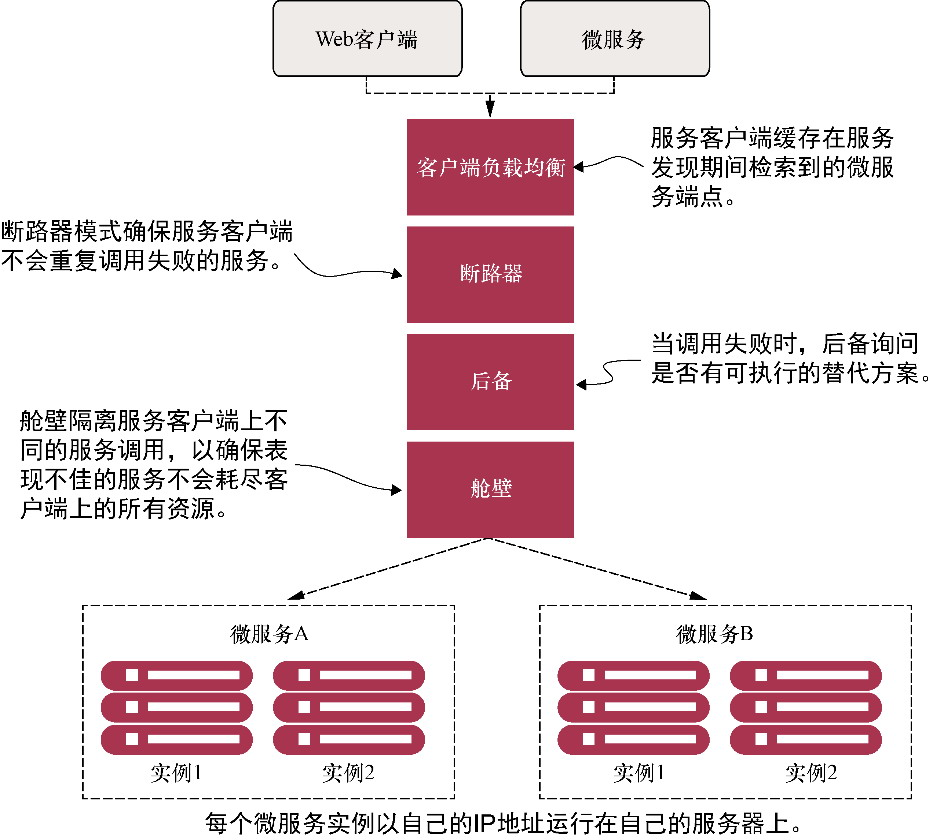

# 6.1 客户端弹性模式

<mark style="color:orange;">**所有的系统，特别是分布式系统，都会遇到故障。**</mark>如何构建应用程序来应对这种故障，是每个软件开发人员工作的关键部分。然而，当涉及构建弹性系统时，大多数软件工程师只考虑一部分**基础设施**或**关键服务**的彻底故障。他们专注于**在应用程序的每一层构建冗余**，使用诸如集群关键服务器、服务间负载均衡以及将基础设施分离到多个位置等技术。

尽管这些方法考虑了系统组件的彻底损失，但它们只解决了构建弹性系统的一小部分问题。<mark style="color:blue;">**当服务崩溃时，很容易检测到该服务已经不在了，因此应用程序可以绕过它。**</mark>然而，<mark style="color:orange;">**当服务运行缓慢时，检测到这个服务性能不佳并绕过它是非常困难的。**</mark>

* <mark style="color:blue;">**服务降级可能起初是间歇性的，然后形成势头**</mark>。\
  服务降级可能只发生在很小的爆发中。故障的第一个迹象可能是一小部分用户抱怨某个问题，直到突然间应用程序容器耗尽了线程池并彻底崩溃。
* <mark style="color:blue;">**对远程服务的调用通常是同步的**</mark>。\
  应用程序开发人员通常调用一个服务来执行一个操作并等待服务返回。服务的调用者**没有超时**的概念来阻止服务调用挂起。
* <mark style="color:blue;">**应用程序经常被设计为处理远程资源的彻底故障，而不是部分降级**</mark>。\
  通常，只要服务没有彻底失败，应用程序就会继续调用一个表现不佳的服务，并且不会快速失败。在这种情况下，**该调用应用程序或服务可能会优雅地降级，但更有可能因为资源耗尽而崩溃**。<mark style="color:blue;">**资源耗尽是指有限的资源（如线程池或数据库连接）消耗殆尽，而调用客户端必须等待该资源再次变得可用。**</mark>

<mark style="color:red;">**性能不佳的远程服务所导致的潜在问题是，它们不仅难以检测，还会触发连锁效应，从而影响整个应用程序生态系统。如果没有适当的保护措施，单个性能不佳的服务可以迅速拖垮多个应用程序。**</mark>基于云、基于微服务的应用程序特别容易受到这些类型的中断的影响，因为这些应用程序由大量细粒度的分布式服务组成，这些服务在完成用户的事务时涉及不同的基础设施。

## 客户端弹性模式

<mark style="color:blue;">**客户端弹性模式**</mark>的重点是，**在远程资源由于错误或表现不佳而失败时，保护调用远程资源的客户端免于崩溃**。这些模式允许客户端**快速失败**，而不消耗诸如数据库连接和线程池之类的宝贵资源。它们还可以防止远程服务表现不佳的问题向客户端的消费者进行**传播**。

<figure><figcaption></figcaption></figure>

这些模式（<mark style="color:blue;">**客户端负载均衡**</mark>、<mark style="color:blue;">**断路器**</mark>、<mark style="color:blue;">**后备**</mark>和<mark style="color:blue;">**舱壁**</mark>）是在调用远程资源的**客户端**（微服务）中实现的。这些模式的实现在逻辑上位于消费远程资源的客户端和资源本身之间。
